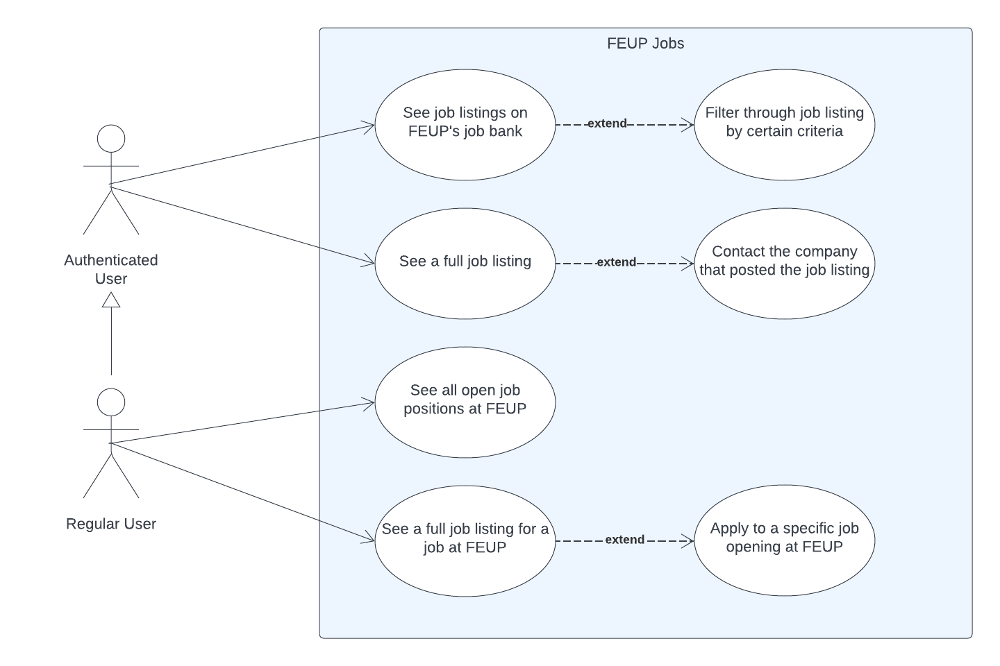

# 2LEIC08T3

## Members

| Name            | Student Number | Email                |
| --------------- | -------------- | -------------------- |
| Miguel Lopes    | up201704590    | up201704590@fe.up.pt |
| Domingos Santos | up201906680    | up201906680@fe.up.pt |
| Afonso Martins  | up202005900    | up202005900@fe.up.pt |
| Eduardo Silva   | up202005283    | up202005283@fe.up.pt |
| José Diogo      | up202003529    | up202003529@fe.up.pt |

# FEUP Jobs

## Vision Stament

For FEUP students who are finishing their course looking for a job and for anyone looking for a job at FEUP. FEUP Jobs is an app that allows the user to interact with FEUP's job database. Unlike SIGARRA, our product will have a pleasing UI that also contributes towards improving the user experience.

## Main Features

- Display all the jobs posted at FEUP's job base
- Contact button that allows users to contact the company that posted the job
- Filter through job listings (by area of expertise, contract duration,...)
- List all the openings to work at FEUP
- Allow the user to apply to job openings at FEUP

## Required API's

- FEUP's Jobs ([Bolsa de Emprego](https://sigarra.up.pt/feup/pt/WEB_BASE.GERA_PAGINA?P_pagina=19498))
- FEUP Internal Jobs ( [Processos de Recrutamento](https://sigarra.up.pt/feup/pt/cnt_cand_geral.concursos_list))

## Use Case Documentation

| **Use Case**                         | **1**                                                                                                                                                                                                                        |
| :----------------------------------- | :--------------------------------------------------------------------------------------------------------------------------------------------------------------------------------------------------------------------------- |
| **Name**                             | See job listings on FEUP's job bank                                                                                                                                                                                          |
| **Actor**                            | Authenticated user                                                                                                                                                                                                           |
| **Description**                      | FEUP's authenticated users might choose to see an extended list of jobs outside of FEUP to which they can apply                                                                                                              |
| **Preconditions**                    | - The authenticated user must have a valid identification as well as a working password on Sigarra                                                                                                                           |
| **Postconditions**                   | - The actor is able to scroll throught the jobs bank listing  - The authenticated user gets access to another use case related to contacting the employer  - The authenticated user becomes allowed to see job details |
| **Normal Flow**                      | 1. The authenticated user logs into the app with FEUP's credentials   2. Opens the menu   3. Selects the jobs listing option   4. The system shows the jobs bank   5. Further actions can be taken from there    |
| **Alternative Flows and Exceptions** | 1. The user is not authenticated and can see the listing but not interact with it                                                                                                                                            |

| Use Case                          | 2                                                                                                                                                                                                                                                                                               |
| :----------------------------------- | :-------------------------------------------------------------------------------------------------------------------------------------------------------------------------------------------------------------------------------------------------------------------------------------------- |
| **Name**                             | Filter through job listing by certain criteria                                                                                                                                                                                                                                                |
| **Actors**                           | Authenticated User, Regular User                                                                                                                                                                                                                                                              |
| **Description**                      | The user can filter job posts based on a variety of parameters that can be customized to suit their needs                                                                                                                                                                                     |
| **Preconditions**                    | Be able to access the job listings                                                                                                                                                                                                                                                            |
| **Postconditions**                   | The app displays a page with the job listings that are of the user's interest                                                                                                                                                                                                                 |
| **Normal flow**                      | 1. The user acesses the app page that contains the job listings   2. The app shows all the listings that are available   3. The user selects the type of filter and the consitions to use   4. The system reloads and displays only the listings that match the criteria of the user |
| **Alternative flows and exceptions** | 1. If no job listings match the criteria specified by the filters, a warning message is displayed                                                                                                                                                                                             |
